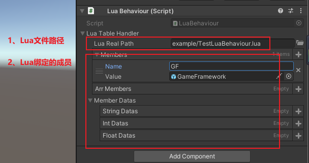
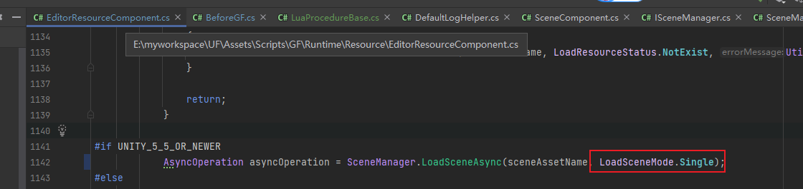

# 说明

## 1、第三方库

1. ThridParty这里看到对应的插件： gameframework 、xlua、odin（淘宝买的）

## 2、gameframework资料

文章：
<https://www.boy3d.com/post/147.html>
<https://www.lfzxb.top/gameframework-fornew/>

Demo：
<https://github.com/DrFlower/TowerDefense-GameFramework-Demo>

API:
<https://gameframework.cn/api/class_unity_game_framework_1_1_runtime_1_1_scene_component.html>

## 3、一些例子

1、LuaBehaviour

## 4、重大修改 可能留坑的问题

1、场景改成单一模式，没有多场景（中小游戏不需要多场景）：
修改原因：纯lua不是用GF的procedure的流程控制模式
